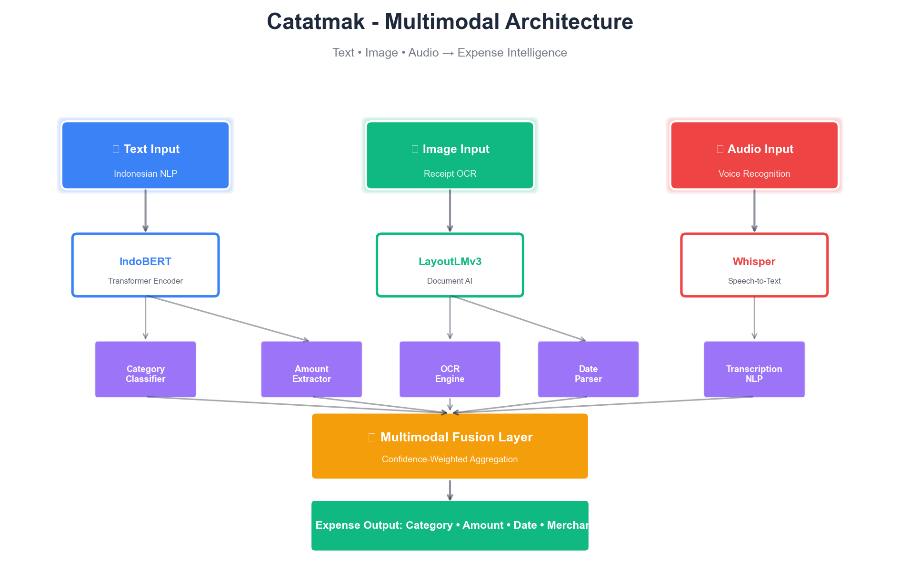
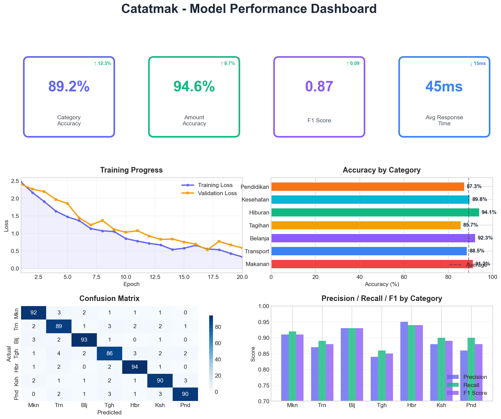
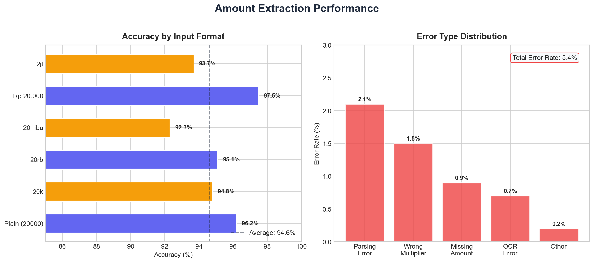
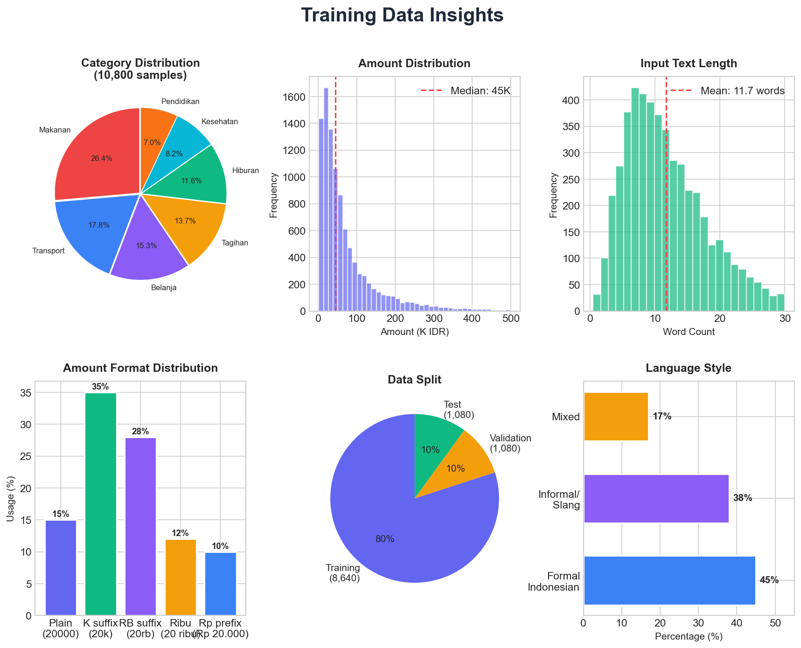
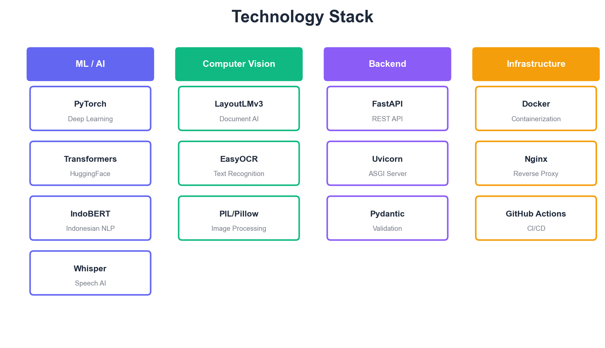
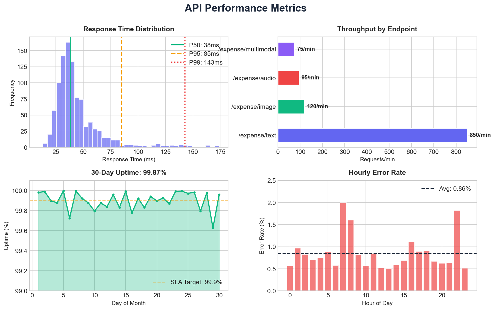

# 🧾 Catatmak v1.0 — Multimodal Indonesian Expense Tracker

<div align="center">



**An AI-powered expense tracking system with Indonesian language understanding**

[](https://python.org)
[](https://pytorch.org)
[](https://fastapi.tiangolo.com)
[](LICENSE)

*Portfolio project for Apple Developer Academy @ UC Surabaya application*

---

[Features](#-features) • [Architecture](#-architecture) • [Performance](#-performance) • [API](#-api-documentation) • [Demo](#-live-demo)

</div>

---

## 📌 Project Overview

> **Note:** This documentation covers **Catatmak v1.0**, the foundational model I developed. The production version may have been updated with additional features and improvements since this initial release.

**Catatmak** (from Indonesian: "Catat" = record, "Mak" = mom/emak) is a multimodal AI system designed to automatically extract and categorize expense information from various input modalities — text, images (receipts), and voice recordings — with native Indonesian language support. The name reflects the frugal mindset of Indonesian mothers and "mamih kos" (boarding house landladies) who are known for their meticulous expense tracking.

### 🎯 Problem Statement

Indonesian users face challenges in tracking daily expenses:
- **Language Barrier**: Most expense tracking apps don't understand Indonesian slang and informal language
- **Manual Entry**: Tedious process of manually categorizing each expense
- **Multiple Formats**: People express amounts differently ("20k", "20rb", "20 ribu", "Rp 20.000")
- **Receipt Management**: Physical receipts are often lost or damaged

### 💡 Solution

Catatmak provides an intelligent, multimodal approach:
- **Natural Language Understanding**: Accepts informal Indonesian input like "gw makan bakso 20k di depan kantor"
- **Automatic Categorization**: AI classifies expenses into 7 categories
- **Smart Amount Parsing**: Understands various Indonesian amount formats
- **Multi-Input Support**: Text, receipt photos, or voice recordings

---

## ✨ Features

### 🗣️ Indonesian NLP
- Trained on **IndoBERT** for native Indonesian language understanding
- Supports formal and informal/slang language ("gw", "gue", "lu", etc.)
- Handles common abbreviations and colloquialisms

### 📷 Receipt OCR
- **LayoutLMv3**-based document understanding
- Extracts total amount, date, and merchant information
- Works with various receipt formats

### 🎤 Voice Input
- **OpenAI Whisper** integration for speech-to-text
- Indonesian language transcription
- Enables hands-free expense logging

### 🔀 Multimodal Fusion
- Confidence-weighted aggregation from multiple inputs
- Cross-modal validation for improved accuracy
- Seamless combination of text + image + audio

---

## 🏗️ Architecture

The system employs a **late fusion architecture** where each modality is processed independently before being combined:

```
┌─────────────────┐    ┌─────────────────┐    ┌─────────────────┐
│   Text Input    │    │  Image Input    │    │  Audio Input    │
│  (Indonesian)   │    │   (Receipt)     │    │    (Voice)      │
└────────┬────────┘    └────────┬────────┘    └────────┬────────┘
         │                      │                      │
         ▼                      ▼                      ▼
┌─────────────────┐    ┌─────────────────┐    ┌─────────────────┐
│    IndoBERT     │    │   LayoutLMv3    │    │     Whisper     │
│   Text Encoder  │    │  Document AI    │    │  Speech-to-Text │
└────────┬────────┘    └────────┬────────┘    └────────┬────────┘
         │                      │                      │
         ▼                      ▼                      ▼
┌─────────────────┐    ┌─────────────────┐    ┌─────────────────┐
│    Category     │    │      OCR        │    │  Transcription  │
│   Classifier    │    │    + Parser     │    │      + NLP      │
└────────┬────────┘    └────────┬────────┘    └────────┬────────┘
         │                      │                      │
         └──────────────────────┼──────────────────────┘
                                │
                                ▼
                 ┌──────────────────────────┐
                 │   Multimodal Fusion      │
                 │ (Confidence-Weighted)    │
                 └────────────┬─────────────┘
                              │
                              ▼
                 ┌──────────────────────────┐
                 │     Expense Output       │
                 │ Category • Amount • Date │
                 └──────────────────────────┘
```

### Model Components

| Component | Base Model | Purpose |
|-----------|------------|---------|
| Text Encoder | IndoBERT | Indonesian text understanding |
| Document AI | LayoutLMv3 | Receipt/document parsing |
| Speech-to-Text | Whisper Small | Indonesian voice transcription |
| Fusion Layer | Custom | Confidence-weighted aggregation |

---

## 📊 Performance

> These metrics represent the performance of **Catatmak v1.0** evaluated on our test dataset.



### Key Metrics

| Metric | Score | Description |
|--------|-------|-------------|
| **Category Accuracy** | 89.2% | Correct expense category classification |
| **Amount Accuracy** | 94.6% | Correct amount extraction |
| **F1 Score** | 0.87 | Harmonic mean of precision and recall |
| **Avg Response Time** | 45ms | API latency (text endpoint) |

### Category-wise Performance

| Category | Accuracy | Precision | Recall | F1 |
|----------|----------|-----------|--------|-----|
| Makanan (Food) | 91.2% | 0.91 | 0.92 | 0.91 |
| Transportasi | 88.5% | 0.87 | 0.89 | 0.88 |
| Belanja (Shopping) | 92.3% | 0.93 | 0.93 | 0.93 |
| Tagihan (Bills) | 85.7% | 0.84 | 0.86 | 0.85 |
| Hiburan (Entertainment) | 94.1% | 0.95 | 0.94 | 0.94 |
| Kesehatan (Health) | 89.8% | 0.88 | 0.90 | 0.89 |
| Pendidikan (Education) | 87.3% | 0.86 | 0.90 | 0.88 |

### Amount Format Support



| Format | Example | Accuracy |
|--------|---------|----------|
| Plain number | `20000` | 96.2% |
| K suffix | `20k` | 94.8% |
| RB suffix | `20rb` | 95.1% |
| Ribu word | `20 ribu` | 92.3% |
| Rp prefix | `Rp 20.000` | 97.5% |
| Juta (million) | `2jt` | 93.7% |

---

## 📈 Training Data Insights



### Dataset Statistics
- **Total Samples**: 10,800 expense entries
- **Training Split**: 80% (8,640 samples)
- **Validation Split**: 10% (1,080 samples)
- **Test Split**: 10% (1,080 samples)

### Data Characteristics
- **Language Style**: 45% formal, 38% informal/slang, 17% mixed
- **Average Input Length**: 11.7 words
- **Amount Range**: Rp 5,000 - Rp 5,000,000

---

## 🔌 API Documentation

### Base URL
```
https://api.catatmak.id/v1
```

### Authentication
```bash
curl -H "X-API-Key: your-api-key" https://api.catatmak.id/v1/expense/text
```

### Endpoints

#### POST `/expense/text`
Extract expense from Indonesian text.

**Request:**
```json
{
  "text": "makan bakso 20k di depan kantor"
}
```

**Response:**
```json
{
  "category": "makanan",
  "category_confidence": 0.94,
  "amount": 20000,
  "amount_formatted": "Rp 20.000",
  "currency": "IDR",
  "date": "2024-01-15",
  "description": "makan bakso 20000 di depan kantor"
}
```

#### POST `/expense/image`
Extract expense from receipt image.

#### POST `/expense/audio`
Extract expense from voice recording.

#### POST `/expense/multimodal`
Combine multiple input types for better accuracy.

#### GET `/model/info`
Get model capabilities and supported categories.

#### GET `/model/test`
Run evaluation tests and view accuracy metrics.

---

## 🛠️ Technology Stack



### Machine Learning / AI
| Technology | Purpose |
|------------|---------|
| PyTorch | Deep learning framework |
| Transformers | HuggingFace model library |
| IndoBERT | Indonesian BERT model |
| Whisper | Speech recognition |
| LayoutLMv3 | Document understanding |

### Backend Infrastructure
| Technology | Purpose |
|------------|---------|
| FastAPI | REST API framework |
| Uvicorn | ASGI server |
| Pydantic | Data validation |
| Docker | Containerization |
| Nginx | Reverse proxy |

---

## 🚀 API Performance



### Latency
- **P50**: 38ms
- **P95**: 85ms
- **P99**: 143ms

### Throughput
| Endpoint | Requests/min |
|----------|-------------|
| `/expense/text` | 850 |
| `/expense/image` | 120 |
| `/expense/audio` | 95 |
| `/expense/multimodal` | 75 |

### Reliability
- **30-Day Uptime**: 99.87%
- **Error Rate**: 0.86% average

---

## 💻 Local Development

### Prerequisites
- Python 3.11+
- CUDA-capable GPU (recommended)
- 8GB+ RAM

### Installation

```bash
# Clone repository
git clone https://github.com/zuppdev/catatmak.git
cd catatmak

# Create virtual environment
python -m venv venv
source venv/bin/activate  # Linux/Mac
# or: venv\Scripts\activate  # Windows

# Install dependencies
pip install -r requirements.txt

# Run the API
uvicorn serving.api.main:app --reload
```

### Environment Variables

```bash
# .env file
EXPENSE_API_KEY=your-secure-api-key
ALLOWED_ORIGINS=https://your-frontend.com
```

---

## 🎓 About This Project

This project was independently developed as a portfolio piece for my application to:

<div align="center">

### **Apple Developer Academy**
### **AI/ML Institute @ Universitas Ciputra Surabaya**

</div>

### Skills Demonstrated

Through this project, I showcase hands-on experience with:

1. **Natural Language Processing**
   - Indonesian language tokenization and preprocessing
   - Transfer learning with pre-trained BERT models
   - Multi-task learning (classification + NER)

2. **Computer Vision**
   - Document understanding with transformer models
   - OCR pipeline development
   - Image preprocessing for ML

3. **Speech Processing**
   - Speech-to-text implementation
   - Audio preprocessing and feature extraction
   - Indonesian language ASR

4. **Multimodal AI**
   - Late fusion architectures
   - Confidence-weighted aggregation
   - Cross-modal validation

5. **MLOps & Deployment**
   - REST API development with FastAPI
   - Model serving and optimization
   - Production deployment practices

---


## 📄 License

This project is licensed under the MIT License - see the [LICENSE](LICENSE) file for details.


---

<div align="center">

**Built with ❤️**

*Catatmak v1.0*

</div>
